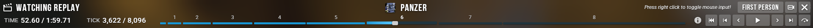
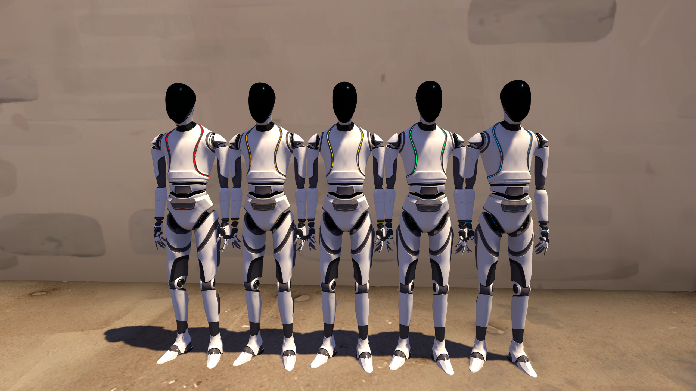
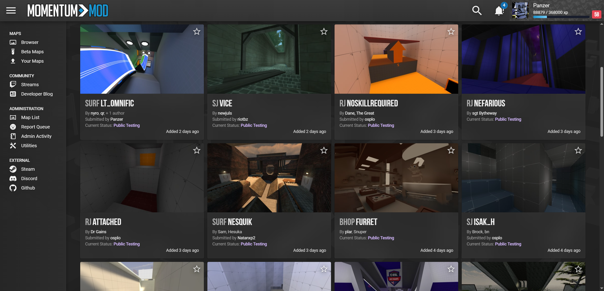
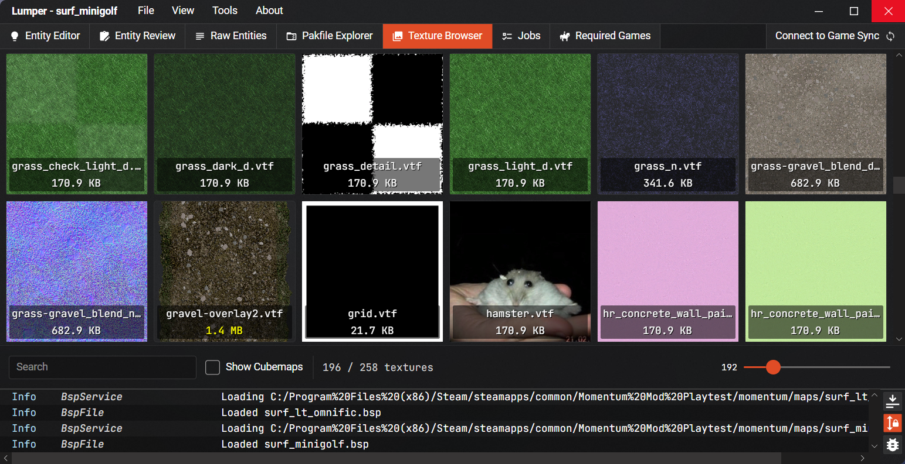
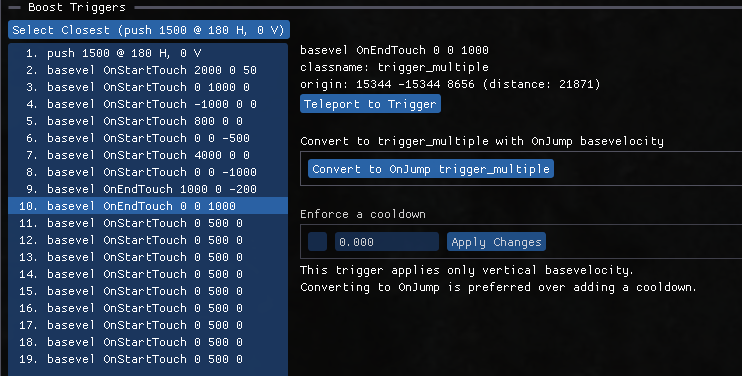
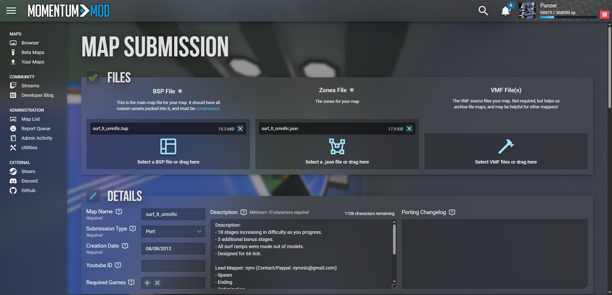

Big updates don't need a big introduction.

The 0.10.0 update overhauls and upgrades many essential game systems, and the game is now in a place where we are excited to invite players in and show it off.

And as such...

# **Momentum Mod is now in fully open playtesting!**

If you haven't already, you can request access on [our Steam store page](https://store.steampowered.com/app/669270/Momentum_Mod/). As of this update, everyone gets in instantly and automatically -- no more waiting, no more "drops!"

## Getting on Track for Success

Momentum Mod had been in limited playtesting for a while and was already making waves across the various movement communities. However, the reality was that, even as of version 0.9, we still had some unique and challenging technical hurdles to overcome and a mountain of things to account for if we wanted to put out a game that doesn't just meet the standards of existing movement communities, but *also* elevates everything to a new level.

For one thing, the Source Engine is built from top to bottom for competitive games that run their gameplay through an online server. The promise of Momentum Mod, on the other hand, is to be a competitive and social multiplayer game that runs your gameplay entirely locally. As great as the Source Engine is, it doesn't come with all of the tools necessary to make that happen! So while it may be relatively easy to get a traditional multiplayer Source server with some movement maps up and running, we had a number of unique problems to understand and solve to get Momentum Mod to where it really needed to be.

But even with all of that in place, we still had to get up to speed with existing movement communities which have had a decade or more to build and refine their map pools, zones, and the many little details in between that make for a healthy competitive ecosystem. Momentum Mod may be starting with fresh leaderboards, but it shouldn't feel like a fledgling community that is still working things out when it comes to gameplay and competitive integrity.

And on top of it all, we've had to do all of this as a small team — including many immensely helpful community contributors — working entirely for free, in our free time.

It's hard to overstate the massive, multi-year effort that went into this milestone. The 0.10.0 update comes with a **complete overhaul and upgrade** of our timer, zones, replays, and multiplayer tech, not to mention powerful porting and zoning tools, an extensive map submission and review system, and no shortage of website and backend work necessary to support these things and future development to come.

## Timer and Zones
We have completely redesigned and remade our timer and zone systems. These are not just up to par with those found in other games, but feature cutting-edge functionality and design.

Here are the highlights:
- Added stage and bonus tracks with their own leaderboards.
- Generally improved the restrictions around what is allowed when starting a run according to the standards of each game mode. This includes start speed limitations and restricting the ability to start from an elevated position (where appropriate).
- Every track start zone now has an explicitly defined teleport destination, including an appropriate yaw angle so the player faces forward when teleporting to the zone with a command.
- Timers for multiple tracks can now run simultaneously and independently of each other.
	> This means while you are running a main track with stages, you can also set a personal best time on one of the individual stage tracks and have it submit to the leaderboard. Simultaneous timers also work with bonuses. For example, on surf_sinsane you can run the main track, and, once you finish it, continue onto the extra bonus portion at the end to attempt a bonus completion in the same run.

- Added commands for switching tracks:
	- `mom_main`
	- `mom_stage <number>`	
	- `mom_bonus <number>`
	
	You can also switch tracks from the tab menu.
- `mom_restart_stage` can now also be used to restart a non-staged main track or a bonus track.
- When a teleport trigger teleports the player to a zone while only retaining downward velocity (as on most Surf stages), air acceleration is disabled until the player lands on the ground.
- When a teleport trigger teleports the player to a zone while only retaining downward velocity, the zone does not activate until the player lands on the ground.
	> This ensures the optimal route for ending a stage is the same whether you are optimizing for the entire map or just that one stage.

- Added support for timer checkpoints which may be activated in any order. This can be enabled on a per-stage basis.
- Added support for optional timer checkpoints which provide timer splits but do not gate progress through the track. This can be enabled on a per-stage basis.
- Added support for "drop" start zones. If there is no standable ground below a track start zone's teleport destination, the track's timer starts as soon as the player teleports to it. The player does not have to drop out of the bottom of the zone first.
- Added a new zone type which allows the player to keep all of their speed when jumping (a.k.a. bhop) while inside it. Bhopping can be enabled at the gamemode level, or per-track, or with this new zone type.
- Added a feature where the player is allowed to bhop on any surface of a certain size or larger.
	> On gamemodes that enable this feature (currently, Surf), if a square with a certain side length fits anywhere on the ground where the player jumps, they are allowed to bhop even if the gamemode would otherwise disallow it. For example, this allows the player to bhop on the platform at the end of a Surf stage (without needing a bhop zone), but not on narrow ramp spines or small detail geometry. This will, however, allow the player to jump on *large* ramp spines or any other large surface which is easy to aim for, and we hope this will keep some amount of organic bhop usage in a gamemode like Surf that does not otherwise allow unrestricted bhopping.

- Fixed a long-standing Source Engine bug that could cause the player to activate a zone while just barely outside of it, most notably by pressing up against the side of an end platform.
- Timer command safeguards have been reworked and improved: when using a command like `mom_restart_track` while the timer is running and is beyond the configured time threshold, the command will not activate until you hold down the bound key for a short period. If your timer is below the configured time threshold, the command instead activates immediately.
- Track and stage restart commands can now conveniently be used for more things: they will now automatically close windows, and if you are spectating, they will respawn you. The commands can also be used to teleport to the map spawn point (like `mom_teleport_to_spawn`) if you are playing an unofficial map with no timer zones set up.
- A message is now shown in the chat box when one of your recently finished runs is submitted to the Momentum Mod backend.

## Replays and Multiplayer Networking (MomentumTV)

Our replay and multiplayer networking systems have also been massively upgraded with a new engine-level system called **MomentumTV**.

If you have heard of "SourceTV" or "GOTV" from other Source Engine games, MomentumTV is similar: it records data networked from the server to the client (which both exist on your own computer when you play Momentum Mod) and can play this data back later. This is essentially how Source Engine demo files work, though while demos require exiting a map, waiting to load into the demo, and watching it like a movie in a video player, **MomentumTV Replays** can be seamlessly loaded and played back ***without exiting/reloading the map***. 

Replay files can be played back alongside you to give you a "ghost" to race against, or, like a demo, can be spectated directly to see a truly one-to-one recreation of the original recorded gameplay, including projectiles, weapon animations, sounds, the HUD, and **even the activity of map entities like doors and buttons.**

But unlike demos, you can *instantly* jump to any part of a MomentumTV replay, or even drag the play head with your mouse to find the exact gameplay tick you are looking for, in real time.

This is a substantial upgrade over our old replay system, which was server-based like replay systems on other Source Engine games. The old system required us to write lots of custom logic for all of the various gameplay components that had to be recreated, and the resulting replay could only be an approximation of what actually happened. The new MomentumTV replays, on the other hand, are both incredibly accurate to real gameplay and far easier to develop for and expand on in the future.

| Replay Tech | Accuracy | User Experience | Difficulty Expanding It |
| ----------- | --------- | -------------- | ------------------------ |
| Source Engine Demos | 10/10 | 2/10 | N/A |
| Replays on other Source games | 6/10 | 5/10 | Difficult, limited capabilities |
| Replays on Momentum Mod 0.9.38 and below | 6/10 | 8/10 | Moderately difficult |
| **Replays on Momentum Mod 0.10.0+** | **9.5/10** | **10/10** | **Easy** |

### Peer-to-Peer Multiplayer — in the Source Engine?

So, we've "solved" replays in a way that hasn't been done before in Source Engine movement games. But what about multiplayer?

Traditionally, the Source Engine provides an extremely high-quality multiplayer experience out-of-the-box without much trouble — you just have set up a dedicated or listen server for players to connect to. Movement communities on other games have always had the benefit of not having to even think about the multiplayer component — it just works.

The problem for us is, by design, Momentum Mod is all about *never* requiring you to connect to a remote server and being subjected to the pains that come with that. So if we want your gameplay to always be controlled by *your* computer, but still allow you to play alongside a whole mob of other people, what we need is **peer-to-peer multiplayer**.

The trick to this is that MomentumTV replays are about 90% of the way to a peer-to-peer multiplayer system! The idea is, instead of recording your gameplay to a file to be played back later, just send it to other players right away so they can get that same high-quality MomentumTV Replay experience, but in real-time. And since the data captured by MomentumTV is *the same data traditionally used for online multiplayer*, this setup works extremely well.

And by the way, our peer-to-peer multiplayer is routed through Steam's secure networking infrastructure, which keeps your IP address private.

| Multiplayer Tech | Accuracy | Maintenance Effort |
| -------------- | ----------- | ----------------- |
| Default on other Source games | 10/10 | None necessary |
| Momentum 0.9.38 | 3/10 | Difficult |
| **Momentum 0.10.0+** | **9.5/10** | **Easy** |

While MomentumTV does make continued development a breeze, it was no small effort to create! But it was absolutely critical for the game to have not just a multiplayer experience on par with other games, but also a high-quality and reliable replay system, so it was well worth the effort.

## New Player Model

With all our improvements to multiplayer, it’s high time that the age of the generic 3D shapes comes to an end and we move to a humanoid player model. Thanks to the work of False_ and VortexPDX, we now have a fully-rigged, mostly (few bugs to iron out) animated model, and we have some exciting plans in the future for additional animation states involving surfing and air strafing.

For those who miss being able to customize their pink rhombus or green dodecahedron, we’ve added the ability to customize both the base model color and the emissive blue trim, which extends to your weapon models, projectiles, and particles!

## Website and Backend Systems

Momentum’s backend systems sat in development hell for multiple years. Starting out as a college project in JavaScript/NodeJS, it developed a reputation for being hard to work with and saw few contributors. Since 2022, we set out to migrate over to TypeScript and significantly clean up at codebase, and with 0.10.0 releasing this backend will finally be deployed. Besides map submission we’ve kept largely feature-complete with the old backend, but the new one should be faster, more scalable, and fingers crossed able to comfortably deal with the influx of new players at 0.10.0! 

In addition, the [front page](https://momentum-mod.org) has been completely redesigned, and the website [dashboard](https://dashboard.momentum-mod.org) has been upgraded with a new look and no longer requires logging in to view ranked maps and their leaderboards.

## Map Porting and Submission
Momentum Mod is all about maps, and with so many to account for, preparing and adding them needs to be a community effort.

In addition to all of the game improvements listed above, we've been working very hard on a comprehensive set of tools and processes for porting, fixing, testing, submitting, and reviewing maps for Momentum Mod's official map library, allowing anyone to contribute.

Community members may submit maps made by themselves or by other people. If you are a map author and want to have a chance to port your map yourself or otherwise give porting input, please fill out our [map author porting feedback form](https://docs.google.com/forms/d/e/1FAIpQLSeheNDY5A960u6GtXCHtt3s_2vZJL3o5tMJ_ZNbYOpb6cx5nQ/viewform).

### Map Porting, Zoning, and Submission Guides

Our new-and-improved guides make it easier than ever to learn how to take a community-made map, fix up any quirks and technical issues, set up timer zones, and generally ensure a map meets Momentum Mod's quality standards. 

Anyone can learn the ropes and contribute, but know that even with our user-friendly tools, this can be a technical effort! 

If you're interested, check out the guides on our website:

[Map Porting Guide](https://docs.momentum-mod.org/guide/map_submission/map_porting/)

[Map Zoning Guide](https://docs.momentum-mod.org/guide/map_submission/map_zoning/)

[Map Submission Guide](https://docs.momentum-mod.org/guide/map_submission/map_submission/)

### Porting Tools

#### Lumper

Lumper is an open-source program used to inspect and modify Source Engine BSP files. It can add or remove entities, adjust entity properties, replace texture assets, apply Stripper directives, and is overall a powerful tool for reviewing and fine-tuning maps without recompilation. For more information, check out our [map porting guide](https://docs.momentum-mod.org/guide/map_submission/map_porting/), or visit [Lumper's GitHub page](https://github.com/momentum-mod/lumper).

#### BSP Convert
BSP Convert is an open-source command-line interface tool for converting maps from Quake 3 into the Strata engine (the extension of the Source Engine which Momentum Mod runs on). The main advantage of this tool is that it preserves lightmap data which is normally lost during decompilation. It also automates the vast majority of the porting process, reducing the time it takes to port maps from hours of manual effort to seconds with one command. For more information on the project, visit [BSP Convert's GitHub page](https://github.com/momentum-mod/bspconvert).

#### In-Game Entity Tools

The in-game "Entity Tools" help a map porter explore and modify entities which commonly need adjustments before the map can be made official. For example, the tools make it easy to set the "keep negative Z velocity only" mode to the right teleports on a surf map, or to quickly substitute `trigger_push` start boosts with the more robust `trigger_setspeed` and immediately test the updated trigger for correctness.

These tools produce a set of Stripper directives that can be applied to the BSP using Lumper, without recompiling the map. For more information, check out our [map porting guide](https://docs.momentum-mod.org/guide/map_submission/map_porting/).

#### Zoning Tools

Our in-game zoning tools have been remade to support the new zone system and were upgraded with a massively improved user experience. The tools can be accessed by turning on `sv_cheats 1` and using the button that appears in the bottom left corner of the tab menu.

For those that prefer to use Hammer, zones can still be set up there and exported as part of the compile chain or as an independent action, using zonemaker.exe (formerly zonmaker.exe). However, note that zoning in Hammer is somewhat limited compared to using the in-game tools (definitely give the in-game tools a try!)

Check out our [zoning guide](https://docs.momentum-mod.org/guide/map_submission/map_zoning/) for more information.

### Map Submission and Review System

Once a map has been carefully fixed up, zoned, and tested according to our guidelines, it can be submitted for approval as an official Momentum Mod map using our new map submission and review system.

Using a streamlined form on our website, upload the BSP and zone files along with screenshots and other necessary information like author names and track difficulty tiers, then wait for the map to be reviewed. Reviewers from the community can test your submission and respond with feedback to help you get the map to where it needs to be.

When the map passes the review process, it is added to the game for everyone to download and play!

## Entity Updates
The 0.10.0 update is the time to start building our official map catalog, so it was important to expand and fine-tune our game entities to give ourselves and community mappers the tools needed to get existing maps to a high-quality standard.

Momentum Mod's exclusive new entity types have been improved and refined, and other critical entities like `trigger_teleport` have been given some much-needed attention as well.

Here's some improvements we are most excited about:
- Teleport triggers that make you face in a certain direction now also reorient your velocity direction, so you will no longer get tossed in the wrong direction.
- Start boosters can be replaced with the improved `trigger_setspeed` entity to prevent players from having to perform obscure and RNG-like boost techniques to stay competitive.
- The new `OnJump` entity output improves the consistency of boosters that boost you when you jump. It also prevents crouch boosting and other anti-competitive multi-boost techniques.
- The new `filter_momentum_surface_collision` entity makes it easier than ever for mappers to set up fail teleports around complicated geometry. No more immersion-breaking non-solid displacements or tedious trigger shaping that still leaves tiny surfaces you can touch without being teleported.
- Our most notable new gameplay entity `trigger_momentum_slide` has been replaced with `func_slide`, which is easier for mappers to use and eliminates some movement bugs.

**You can see a more complete list of changes below:**
{{
}}

#### Teleport Triggers
The settings of our Teleport Trigger entities were a bit chaotic before and have been greatly cleaned up:

- The "Preserve angles" spawnflag is now hidden in Hammer in favor of the newer `UseLandmarkAngles` key, which is now displayed as "Use Destination Angles". The "Preserve angles" spawnflag is still supported if a map made with an older Source Engine branch is loaded in game.
- Removed redundant "reset angles" setting
- Removed the "Velocity Scale" setting.
- Removed the "Reorient Landmark" setting.
	> This was used to choose whether to use the landmark teleport rotation logic from older or newer Source Engine branches, but the new logic is backwards compatible with the old logic, so the new logic is now always used.

- Removed the landmark teleport setting from the rest of the "modes". The remaining modes are now all "velocity modes" and are no longer mutually exclusive with landmark teleports. The velocity modes are now also supported by the `point_teleport` entity.
- The setting which causes the trigger to activate on `EndTouch` instead of `StartTouch` is now a standard key instead of a spawnflag for better visibility.
- Removed `trigger_momentum_teleport_progress` and re-added `trigger_momentum_teleport`, which is the same as `trigger_teleport` but with an additional option which uses the player's current progress destination as the teleport destination.
- When a teleport trigger uses a velocity mode other than the classic "Retain" mode, that velocity effect will now always take priority over other effects applied in the same tick, like a `trigger_push` boost.
- Teleport triggers now adjust the destination position upward up to one unit to keep the player's feet from getting stuck.
- Teleport triggers now always pick the first entity in the entity list matching the destination name (older Source Engine branch behavior) instead of cycling through each match with each successive teleport (newer Source Engine branch behavior).

Additionally, when a teleport trigger is configured to snap player view angles to the destination angles (a.k.a. `UseLandmarkAngles`), the horizontal component of the player's velocity is now also aligned to the destination angles. This means players are no longer flung off-course when teleported somewhere with a different forward direction!

#### Improvements to `trigger_setspeed`
- Simplified and expanded the entity's settings and generally made it more intuitive to use. You now configure how it should affect the player's horizontal speed and vertical speed separately.

- Horizontal speed behaviors:
	- Set exact speed and velocity yaw
	- Set exact speed without changing velocity yaw
	- Set speed only if moving slower (enforce a minimum speed)
	- Set speed only if moving faster (enforce a maximum speed)
	- Do nothing

- Vertical speed behaviors:
	- Set exact speed
	- Set speed only if lower (possibly a higher magnitude in the negative direction)
	- Set speed only if higher (possibly a lower magnitude in the negative direction)
	- Do nothing

- Added a new setting called "Strict Mode" which adds several restrictions on the trigger's behavior. For example, the trigger wont activate if the player jumps into it, and ducking is disabled while the trigger is active.
	> This mode ensures the trigger gives extremely consistent results and is intended for use with most track-start boosters.

#### Other Entity Changes
- Added `filter_momentum_surface_collision`. This filter can detect if the player is touching anything, touching a standable surface, touching a non-standable surface, or touching a specific material, and can limit this to only brushes, models, and/or displacements.
	> This filter can be used to effortlessly set up precise fail teleports, instead of needing to hand-make a lot of carefully sculpted triggers. For example, you could place a single `trigger_teleport` around an entire Surf track and use this filter with the "touching a standable surface" mode so that the player is reset if they touch anything that is not surfable.
- `trigger_momentum_progress` now has a teleport destination property instead of using the origin of the trigger itself.
	> Note: The progress teleport system is also disabled for now until we add support for it in the new timer system.

- Added player inputs that increase the player's speed in the direction they are moving: `AddSpeed` (for 3D speed), `AddHorizontalSpeed`, and `AddVerticalSpeed`.
	> These let you create I/O-based omnidirectional boosts, in contrast to something like `AddOutput basevelocity X Y Z` which is always in a fixed direction.

- The bhop prevention setting of `trigger_momentum_limitmovement` now causes the player's speed to be capped when jumping instead of disabling jumping for an arbitrary number of ticks.
- Added support for the "grenadeclip" contents type, such as with the material `tools/toolsgrenadeclip` from CS:GO. This is solid to projectiles like stickybombs and rockets, but not to the player or anything else.
- Removed the "stick on entering this area" option from `trigger_stick_explosive` in favor of grenadeclip brushes. We plan on adding more projectile collision tools in the future.
- Added `OnJump` and `OnLand` outputs to all trigger entity classes.
- Added the `func_touch` entity class. This is a *solid* brush entity with all of the same outputs as `trigger_multiple`. For example, you can fire an output when the player collides with the entity (`OnStartTouch`) or jumps off of it (`OnJump`).
- When exiting a `trigger_push`, the player is no longer boosted by an extra half of one tick portion of the boost amount. For example, a 1000 units/sec `trigger_push` on 100 tickrate would previously boost the player by an extra 5 units/sec when exiting it.
- Removed `trigger_momentum_push`, which did not provide any unique functionality.
- Removed `trigger_reversespeed`. We plan on replacing this with a more capable and robust solid entity in the future.
- Removed `trigger_shootboost`. This entity was meant to make it easier to make shoot boosts, but this is an old-school mechanic that has fallen out of favor and is best left to legacy maps.
- Removed `filter_momentum_progress` and `filter_momentum_track_number`, and added `filter_momentum_timer_progress` with similar functionality.
- Removed `trigger_momentum_slide` in favor of `func_slide`.
- Removed `filter_momentum_player_state` in favor of the similar `filter_momentum_surface_collision`.
- Removed `env_surface_teleport` in favor of using `filter_momentum_surface_collision` with a `trigger_teleport`.

{{
}}

## Gamemodes
- Added the following new gamemodes:
	- Half-Life Bhop
	- Counter-Strike 1.6 Climb
	- VQ3 Defrag: Default movement settings from Quake 3 Arena
	- Vintage Defrag: Reminiscent of Quake 1 movement, with some adjustments for faster paced gameplay
- Defrag changes:
	- Added support for Defrag modifier bonuses. These bonuses have you running the map but with the addition of one of more of the following modifiers: haste, slick, damage boost, rockets, plasma gun, and BFG.
	- Added overbounce zones. These zones allow the player to overbounce while inside of their volume.
	- Updated start zones to allow the player to pre-run inside of their volumes. This means the player can bhop or use rockets to gain speed inside of the zone, but their timer doesn't start until they leave the zone.
- Sticky Jump changes:
	- Added an experimental new knockback mode for stickybombs which cancels all knockback taken during the tick if stickybomb damage would exceed 175. You can try this out by enabling the `mom_sj_cancel_lethal_knockback` ConVar.
	- `mom_sj_buffer_window` ConVar to control the stickybomb launcher attack buffer.
	- `mom_sj_set_sticky_limit` command to set the current stickybomb limit.
	- `mom_sj_no_damage_window` ConVar to provide a short buffer after arming where the stickybomb won't contribute to damage taken for the purpose of knockback canceling.
- The still-unimplemented Tricksurf and Parkour game modes are no longer listed in-game and will be revisited later.

## Miscellaneous
- Added clustered rendering, a new rendering system that allows for real-time dynamic lighting. For more information, see https://portal2communityedition.com/clustered
- The entire official map list is now cached locally, enabling the map selector to update instantly as you type or change filters.
- Added roaming lobbies, which automatically connect you to players playing the same map as you (toggle with the `mom_map_lobbies` ConVar).
- Added a "freecam" system to look around the map independently of the player's position. Exiting freecam resumes your control and view of the player. Freecam can be toggled with `mom_freecam`. When your timer is running, the `noclip` command acts like `mom_freecam` instead, so you only need one keybind.
- Added support for automatically playing a replay of your chosen comparison run as a "ghost" for you to race when your timer starts (toggle with the `mom_comparison_ghost` ConVar).
- Added the `mom_teleport_to_spawn` command, which teleports the player to the map spawn location.
- `sv_noclipspeed_duck_multiplier` and `sv_noclipspeed_sprint_multiplier` can now be used to increase noclip speed above the unmodified speed.
- Air friction applied while noclipping is now controlled by the new ConVar `sv_noclipfriction`, which can be freely customized.
- You can now exceed `sv_maxvelocity` while noclipping.
- The map selector is now always browsed in a single game mode at a time.
- Added `mom_official_screenshot` command, which takes a screenshot using the screen resolution and other settings required for official map screenshots.
- Fixed being able to move while inside areas that should be solid, including outside of the world.
- Added `mom_mv_check_ground_quadrants` movement ConVar.
- Added `mom_mv_use_goldsrc_conc_movement` ConVar.
- Added `mom_hud_endofrun_autoshow` ConVar. This can be used to toggle the end of run menu automatically displaying when completing a run.
- Added `mom_play_jump_sound` ConVar. Enabling this will make a sound play when you jump.
- Added a system which more intelligently chooses which game to source map assets from when multiple mounted games provide an asset with the same name. This means maps like rj_quba will no longer use HL2 textures for the glass walls.
- Added a map selector gallery component for viewing official map screenshots.
- Additional UI and infrastructure improvements and small bug fixes
- Other things we forgot about or didn't want to overload you with in this post (try out the game and see everything for yourself!)

## What's Next

When we started working towards 0.10.0 in 2023, we produced the roadmap below. If you’ve read this post closely, you hopefully got a feel for how much of this has been completed. Drag the slider over the image to reveal:



So 0.10.0 has clearly covered a lot of ground! With so many major changes required to core game systems like zoning, timer and replays, websystems and run submission, and the way different developers' schedules fell together, it made sense for us a bundle all of this together. Not just that, but the MomentumTV multiplayer changes above are easily significant enough to have warranted a section on the roadmap somewhere.

This is not to say that 1.0.0 is immediately around the corner. Public playtest opens the game up, but 1.0.0 – our full, “game is functionally there” release – is only happening when we’re confident we’ll never had to reset all leaderboards again. For that, anti-cheat is essential, and we will be wiping leaderboards at 1.0.0 release, and potentially multiple times before then as we work on anti-cheat. That being said, the improvements to core game and backend code that we’ve done for 0.10.0 put us in a great spot going forward, with a motivated team, and clear plan of action. In anticipation of public playtest we’ve also done a significant amount of polish, from improved default binds, a shiny startup video, refreshed UI, enhanced sounds, plus our shiny new websites.

We’re not going to put out an updated roadmap quite yet; post 0.10.0 launch we’ll need to sit down and get our bearings for a bit. Things are likely going to be loud(er) for a while, but we want to focus on fixing things as they arise, and implement what the general community is finding our game to be lacking before putting out another definitive roadmap.

Hopefully this post has given a decent picture of where we’re at for those who haven't been following [our Q&A streams](https://www.youtube.com/playlist?list=PLCZnNnlT4TxiRiQarniL3HREAb6dMCr5L) or been in [our Discord](https://discord.gg/momentummod) ~~yelling at us to release the game~~ hanging out as we share our development progress. 

The entire team is so excited to finally get the release shipped and an open playtest for everyone. We hope you have a fantastic time with it, and remember, there's plenty more where this came from! :)