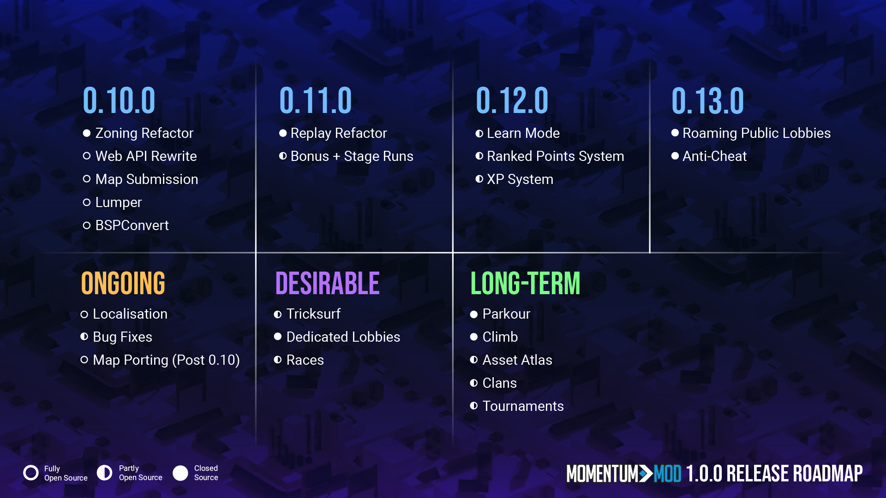

Hello everyone! I'm back again with another update from everyone on the team, and I’ve even got an update _about_ updates for you all that I think you’ll enjoy. This one's a bit of a wordy one, but I promise there's some juicy bits too!

## Let’s Talk About Versions

### 1.0.0 (“Is Momentum Mod Coming Out in 2022?”)

I’ll start with 1.0.0, because we’re approaching the end of 2022, and the Steam store still says (said) that it’s coming out this year, so where is it, bub??

**1.0.0 isn’t coming out this year**, but we’re still working towards it! **I want to change the language around Momentum’s 1.0.0 release to be “look at our Roadmap” instead of giving out dates**, since, realistically, we don’t even know when 1.0.0 will drop until the month of its actual release. The official “release date” now is to be determined, but our answer going forward to the “expected release date” of Momentum Mod is: “when we’re done with the things needed for 1.0.0.” Currently **[our GitHub organization contains the roadmap/feature boards](https://github.com/orgs/momentum-mod/projects)** (see section below) but the plan is to make a more user-friendly version of this to put on **[the main momentum-mod.org webpage](https://momentum-mod.org/)**. We have an infographic version in the meantime:

Momentum Mod is an extremely unique project in that it’s 100% free-to-play, cannot make money from the game itself (or anything in it), and is being worked on entirely out of passion, in our free time as volunteers. The core systems are not fully done yet, so Momentum is not fully public yet. At the same time, we have a growing fan base and slowly churning hype as people understand the purpose of the game, its platform, and what we (will) have to offer. Hence the semi-public Playtest state that we’re in, giving those hyped up a chance to see and play it earlier than others, and, **_ideally_**, giving us feedback as they do.

This balance of “not ready” and “let’s get the word out” is tedious but deliberate, since drawing more people into the game allows us to find more help for the team, and is actually how the Momentum Team has grown to the size it is. However, it unfortunately comes with the drawback that people are _really excited_ to play the game, despite it not really being _fully ready_ for everyone to play yet. Why not have it just be fully open? Because we can only fully release once, and first impressions matter a _lot_ for us.

I want to remind everyone, as I seem to do in every blog post at this point, that we’re all working on this game and its platform for free (out of passion) **_because we want to play and be a part of it_**. Nobody working on the project is paid to work on it, we’re not trying to scam or bait people, and delaying the game hurts us as much as it hurts everyone looking forward to it.

The problem of delaying isn’t from feature/scope creep, it’s actually from trying to formalize (predict) versions when the structure of the team doesn’t really support it. We have core things we need to work on for the platform to be complete, and those that have gotten access to the game already may have seen this firsthand. We need to update Zones to have better tooling and support more features, which requires a new format for them. We need to update Replays to support the newly added weapon modes and be better formatted for any potential future updates needed. We need a Learn section for newbies to not be completely lost upon playing the game for the first time. We need the initial cosmetic system in place to support players not grinding for group times and instead only going for completionist goals. And some more things, but that’s what the roadmap will cover.

Some weeks we’re blazing through bugs and crashes and features, and other weeks we have a shared (combined) ~3 hours of dev time spent on something. This is just how this project has to go, with the whole passion-based development, because working on this in spare time becomes “how much spare time do I have for Momentum compared to other things,” like hanging out IRL with friends and family, and doing other things like work, school, sleep, and so on. Multiply this by however many devs we have, and while the total team free time we’d have to work on Momentum increases, it’s still relatively the same ratio of “work on Momentum” free time to other real life free time for a lot of team members.

Lastly, keep in mind we’re still doing daily Playtest grants, and will increase the rate as we go along! _But also keep in mind that_ **_everything’s going to be wiped before and at 1.0.0_**! Getting access just to play right now may be exciting for a bit, but, unless you report bugs, do mapping, or help out with stuff like translations (see below!) or map porting, the game won’t feel very complete. Still, it’s great to see people getting into the playtest and seeing what we’ve delivered so far, and giving us feedback on stuff as we go!

### Semantic Versioning (X.Y.Z)

There’s another change that I think will make up for the news above. We’re going to be updating how Momentum Mod’s game versioning is done, and the priority surrounding the work for future versions.  

Momentum Mod’s game version follows **[Semantic Versioning](https://semver.org/)** (“semver” for short), where the version notation is three numbers X, Y, and Z, separated by dots. (X.Y.Z) → (0.9.2)

The first number “X” is the platform milestone indicator, so since we’re not fully publicly released, it’s currently 0. At public release, it’ll become 1, and at the campaign update, since we’re “going gold,” it’ll bump to 2.

The second number “Y” is a feature milestone, and in our game’s meaning, is typically “backwards incompatible.” This means things like the new Zone format, or new Replay format, which means “all the old zones/replays will not work at this version,” hence why they’re 0.10.0 and 0.11.0 respectively. If you’ve been following all of the changelog blogs, you’d quickly see that the project hasn't really been following this much (i.e. jumping over to the Chaos Source Engine backend was only 0.8.8 instead of 0.9.0). This is something I’ve wanted to improve for a while now.

The third number “Z” is typically just any patches or smaller things that _are_ backwards compatible, like bug fixes or smaller features like new entities that don’t necessarily break any existing maps. These are, for the most part, what we’ve been releasing in between the changelog blog posts so that our Playtesters are always on the latest code.

So, **[as mentioned on our September edition of our monthly Q&A streams](https://www.youtube.com/watch?v=k6QZpEQ7D7k&t=1100s)** we do over **[on our Twitch](https://twitch.tv/MomentumMod)**, Momentum Mod’s game client will start actually using Semantic Versioning for its releases, instead of the weird “version frozen” updates I’ve been doing. The TL;DR for this section is, **_number will go up now_**!

The in-detail changes are as follows:

1. **We will stop pre-planning the “Z” versions**. For example, the 0.9.3 and 0.9.4 boards are no longer pre-made and pre-filled.
    - We instead have our milestone version (“Y”) boards (0.10.0, 0.11.0, etc) as the only pre-made boards (made way way way in advance, pre-filled with core feature cards)
    - We then only have "next version" as the only “Z” board we have. So we'd effectively only have a "0.9.3" tracker right now, and next Steam push, we test the cards, close the ones that were fixed, and create the 0.9.4 board, moving over anything that didn't get fully fixed.
    - The only cards that are pre-populated on the “Z” boards should be the "High Priority" ones, everything else is up for grabs by devs as they see fit. (And ideally devs are picking up high priority work, as they are usually crashes or very important things to do!)
    - As the “Y” versions are wrapped up and ready for deployment, we coalesce the current “Z” version into it. E.g. We finished the zone format and tools, finished the web related integration, and there's extra cards that devs picked up that would have gone into 0.9.15, we would just release 0.10.0 instead of 0.9.15.
2. **We will aim for a twice-weekly push when possible.** Ideally a Monday and Friday cycle, so that Monday covers work done on the weekend, and Friday covers work done during the week.
    - Pushes to Steam can happen before then, as we see fit (urgent/emergency hotfixes)
    - Considering the variable availability of the team, we may sometimes miss or skip a release day if no/not enough work has been done to warrant a push
3. **Each code-heavy push to Steam will increment a "Z" version**, so instead of "Update (Date)", we're bumping to 0.9.3, 0.9.4, 0.9.5, and so on. The exceptions here are things like small hotfixes and tiny adjustments to models/textures/etc.
4. **Each push will get a simple post here, Steam event post, and post in the #changelog Discord channel** (with a ping for the `@Game Update` role) listing the nitty gritty details of the push, in pure and simple changelog form.
5. **There will only be narrated changelog blog posts for the "Y" feature pushes.** That way the main features (e.g. 0.10.0's zoning and map focus) can be the headlines, but all of the "Z" updates before then (0.9.5, 0.9.6, etc) can be mentioned as a "here's what we accomplished since then" as well.
    - We will also still make blog posts to highlight important features that may have been added before a milestone, e.g. Rio's mouse interpolation work, the goals for map file sizes / mounting, etc.

The reasoning behind all of this is to account for our varied schedules as a volunteer-based team and especially as developers. While core features (map zone format and tools, replay format and tools, etc) can have collaboration, it probably won’t be from all (10+) developers we have on the team. Meanwhile, some developers really want to work on things that speak to them more than what I had haphazardly put in the version boards already, so this can, hopefully, help reduce burnout.

Obviously, there are things that can't be worked on until another core feature is in place, but there are a lot of things that can be started or mocked up or similar until we get to it, which greatly improves our velocity as we approach it. For example, SlidyBat has started work on the replay refactor, Rio has started work on run validation, SCell and Xen tackled the BSP limit increase work, and so on.

Personally, my goal as Development Lead would be to work on the core “Y” feature cards, while offering code review on “Z” version work done. This change is pretty exciting, and hopefully allows for way more velocity when it comes to what’s left for 1.0.0. And, to be honest, it should have been how it was from the start, but you live and learn!

### 0.10.0

So, if you’ve read this far, you’ll understand that our focus for the time being is on getting to 0.10.0. I’m not guaranteeing that 0.10.0 will be out by the end of the year or anything, but it's firmly in our sights and getting close. If you want a significant, tangible milestone to focus on, 0.10.0 is the next big thing to get excited about.

So, what’s coming with 0.10.0?

* Zone file format update
    * New Zone tooling
    * Guides to help external map porters
* BSP Limit Increases
    * All of your favorite game modes just got a lot more room to breathe
    * Continue reading this blog post for a sneak peek ;)
* Map upload process (more-or-less) finalized on the website
    * Website backend rewrite deployed on 1.0.0-ready hardware / vendors
* A truckload of maps added as soon as we can get them
    * We need to test download scaling for when we have so many maps
    * We need to find problems in maps from porting so we can make an exhaustive checklist for when we’re reviewing + adding new maps
* **_CLASSIFIED_**
    * Hint: It’s also related to mapping tooling! ;)

## Coming Soon to a Language Near You

Momentum Mod targets a global audience, so naturally our user interface cannot only be in English, and thus requires localization. This is the process of meticulously converting every English term (“Play Game”) used into tokens (“#UI_Play_Game”), and then using an online platform (we like **[POEditor](https://poeditor.com/)**!) to allow users to help translate everything into every supported language on Steam.

While the Momentum Mod team is composed of people from all over the world, we only have a limited scope of knowledge over all of **[the languages Steam offers support for](https://partner.steamgames.com/doc/store/localization/languages#supported_languages)**, **so we need your help!**

Using our handy new guide on **[Localizing Momentum Mod](https://docs.momentum-mod.org/guide/localization/)**, anyone can help out, and we’re taking all the help we can get for it! There are two “roles” that we have available:

### 1. Translator

Translators are those who help convert the english terms found on POEditor over to a language of choice. All it takes is **[signing up on POEditor for the project](https://poeditor.com/join/project/LZnIxNDkJ4)**, for your language(s) of choice, and helping translate, asking clarifying questions if need be, and making sure to link your POEditor account to your Discord account inside of our “POEditor Account Link” forum channel.

**Anyone can get a key for providing significant translations for the game, and for having productive input on their language – translation isn't an exact science and we're very keen to see discussion. Keys can be granted for discussions _and/or_** **translations.**

Keep in mind that we will be adding more features with User Interface over time, which means more terms needing translation for every language, so we’ll need continued help with translating as we work on the game! Even if your language is at 100% currently, we will be continually adding more terms for translation as we work on more features.

### 2. Localization Lead / “Proofreader”

Localization Leads (also known as Language Proofreaders) are people who know both their language and English well and really want to represent it, becoming the official proofreaders for the language on POEditor. Proofreaders are like the language moderators basically, as all “proofread” terms become locked on the POEditor interface. The leads here would be in charge of saying when terms are “ready for the game” by proofreading them, and should be playing the game in the supported language to verify things are looking alright. That being said, localization is a community effort and the proofreader must be ready to work with other contributors in discussing the nuance of certain translations, and facilitate productive discussion between everyone.

Not everyone can be a localization lead! **[We have a signup form here](https://forms.gle/jHav92ctoDvk8Q7b6)**, and we plan to have a handful of leads per language, depending on how many sign up and how popular the language is (translator-wise).

## Sharpest Open Source Tools in the Shed

While the move to Chaos Source meant the core game development had to go closed-source, we’re still very passionate about open-sourcing as much of Momentum’s development as possible, and releasing all the code we can under the permissive MIT license. This includes our **[web backend and frontend](https://github.com/momentum-mod/website)**, **[Panorama game UI code](https://github.com/momentum-mod/panorama)**, and **[internal Discord bot](https://github.com/momentum-mod/discord-bot)**. But now, in anticipation for the sheer amount of maps coming for v0.10.0, we have a couple new open source projects!

The first is **[Lumper](https://github.com/momentum-mod/lumper)**, a suite of tools for modifying compiled map (BSP) files to tweak entities, textures and more. While Momentum can load CS:S, CS:GO and TF2 maps fine, they typically require small fixups like entity tweaking or removal. Servers typically use “Stripper” configs to execute these, but since we have more control over maps, we want to fix maps from the start and ship the final version. Development of this project has been headed up by BIRD, with some great UI work started by JPaja.

Additionally, new team member Panzer has been working on **[BSPConvert](https://github.com/momentum-mod/BSPConversionLib)**, which is capable of taking a compiled Quake 3 Arena map file and converting it to a Source BSP. Decompiling Q3A maps removes lighting information, making porting decompiled maps to Source a complete chore. With thousands of Defrag maps out there, the only feasible way of porting them all is through some kind of automation, so this tool should be a lifesaver. Both of these tools are in C# .NET, a great language to be familiar with in the 2020s, so if anyone’s got some experience or wants to gain some, we’d love more contributors!

Though, if Javascript/Typescript is more up your alley, we’re always on the lookout for contributors on the **[Main Website](https://github.com/momentum-mod/website)** as well as to our **[Panorama Game UI](https://github.com/momentum-mod/panorama)**. These aren’t just exercises we do instead of working on game code - the website and game UI are essential parts of the project that team members with engine license spend time working on, instead of game code. So by far the most significant way people can help get Momentum 1.0.0 completed is by contributing to these repositories.

We strive to be as friendly and open to programmers of all levels of experience as possible, as well as ensuring contributors work on areas that are genuinely useful to their programming repertoire, not just writing a bunch of unit tests. If you’re interested, check out our #tooling, #website and #panorama (UI) channels **[in our Discord](https://discord.gg/momentummod)**!

## Not So VERY FULL! Anymore

Binary State Partitioning, aka BSP, is the technique used for compiling maps and comes from the 90s Quake engine (idTech) that Source is based on. Unfortunately, as most mappers know, the limits on BSPs have similarly been stuck in the 90s. CS:GO has modified some limits, but otherwise it has kept the majority of them unchanged. More modern Source-based games like Titanfall have completely overhauled the BSP format to fit their needs, and we've planned to do the same ever since we got our Source code access.

We’re excited to announce that starting with 0.9.2, Momentum Mod offers support for BSP version 25, Chaos Source’s new BSP format that raises practically _every_ BSP limit to accommodate mappers’ desires for larger maps.

For those that want the new technical limits:
{{
}}
| **Lump/Data Limit** | **Old (BSP v21)** | **New (BSP v25)** | **Magnitude Increment** |
| ------------------- | ----------------- | ----------------- | :-----: |
| Grid size (units in axis) | 32768 | 131072 | 4x |
| models | 1024 | 16384 | 16x |
| brushes | 8192 | 65536 | 8x |
| brushides | 81920 | 655360 | 8x |
| planes | 65536 | 1048576 | 16x |
| vertexes | 65536 | 1048576 | 16x |
| nodes | 65536 | 1048576 | 16x |
| texinfos | 12288 | 0 (unlimited) | ∞ |
| texdata | 4096 | 16384 | 4x |
| faces | 65536 | 1048576 | 16x |
| HDR faces | 65536 | 1048576 | 16x |
| origfaces | 65536 | 1048576 | 16x |
| leaves | 65536 | 1048576 | 16x |
| leaffaces | 65536 | 1048576 | 16x |
| leafbrushes | 65536 | 1048576 | 16x |
| areas | 1024 | 65536 | 64x |
| surfedges | 512000 | 2097152 | ~4x |
| edges | 256000 | 1048576 | ~4x |
| LDR worldlights | 8192 | 0 (unlimited) | ∞ |
| HDR worldlights | 8192 | 0 (unlimited) | ∞ |
| leafwaterdata | 32768 | 32768 | 1x |
| waterstrips | 32768 | 1048576 | 32x |
| waterverts | 65536 | 1048576 | 16x |
| waterindices | 65536 | 1048576 | 16x |
| cubemapsamples | 1024 | 16384 | 16x |
| overlays | 1024 | 16384 | 16x |
| edicts | 2048 | 8192 | 4x |

For those that just had this entire table go over their heads, no problem!
{{
}}

The gist of it is: maps are now ***64 (4^3) times*** the volume found in CS:GO; maps are now allowed to be **_BIG_**. How much bigger? Xen made a lovely video to help demonstrate some possibilities:



We’re looking forward to hearing feedback from mappers as they use (and abuse) the new limits! Keep in mind this change is only applicable to any Chaos Source Engine game, and thus the maps created on this new version will not be able to be used in any (older) Source game like CS:GO.

## Full Changelog

{{
}}



{{
}}

---

As another Thanksgiving comes and goes, I just want to say that I am extremely thankful for the team and community forming around this project. I know at times the pace the project goes seems slow, but I like to imagine it more like this snowball just slowly rolling down a hill towards 1.0.0. It’s slowly getting bigger, but it’s going to make much more of an impact when it hits! :)

We’re currently sitting at roughly 22,000 people in the playtest, with another 15,000 awaiting access, and a total wishlist count of 36,000. It’s always absolutely amazing to see the continued interest in the project, and we look forward to getting it in every single one of your hands! In the meantime, consider [joining our official Discord server](https://discord.gg/momentummod) to hang out and ~~yell at~~ motivate us, and [request access to the Playtest](https://store.steampowered.com/app/669270/Momentum_Mod/) if you haven’t!

Until, well, [0.10.0](https://github.com/orgs/momentum-mod/projects/20) now! ;)  
Nick (Gocnak) K.  
Momentum Mod Project Lead
